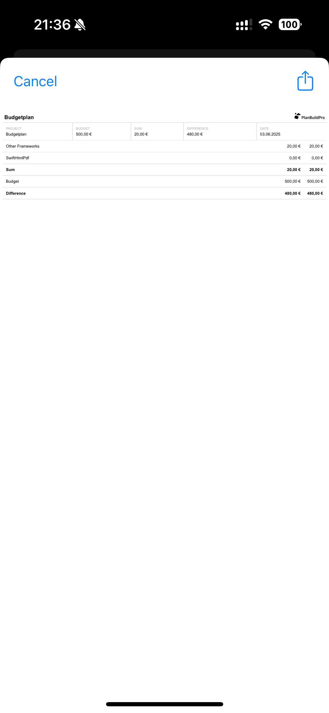

# SwiftHtmlPdf

 

<p align="left">
<a href="https://cocoapods.org/pods/SwiftHtmlPdf"></a>

<a href="https://developer.apple.com/swift"></a>
<a href="https://github.com/NGromann/SwiftHtmlPdf/blob/master/LICENSE"></a>
</p>

Lightweight HTML and PDF templating using Swift.

This library allows you to generate HTML and PDF using HTML template files. Try out our [example project!](/Example/SwiftHtmlPdfExample)

## Table of Contents
- [Requirements](#requirements)
- [Installation](#installation)
- [Usage](#usage)
  - [Workflow](#workflow)
  - [Create a HTML template resource and save it in your project](#create-a-html-template-resource-and-save-it-in-your-project)
  - [Fill the template with data](#fill-the-template-with-data)
  - [Show a Preview Dialog in your app](#show-a-preview-dialog-in-your-app)
  - [Parsing templates without the Preview Dialog](#parsing-templates-without-the-preview-dialog)
- [FAQ](#faq)

## Requirements

* IOS 10+

## Installation

You can install SwiftHtmlPdf using Cocoa Pods.

Add SwiftHtmlPdf into your project's `Podfile`:

```ruby
target 'MyApp' do
  pod 'SwiftHtmlPdf', '~> 1.0'
end
```

Then run the following command:

```bash
$ pod install
```

## Usage

### Workflow

SwiftHtmlPdf works in 3 layers.

##### [HTML](#Create-a-html-template-resource-and-save-it-in-your-project)
You create a template HTML document that will then be filled with your data from the Swift code. 
We defined 3 new HTML tags, that can be used to fill your HTML document with all kinds of data structures.

##### [Swift](#Fill-the-template-with-data)
Using a `PDFComposerDelegate` you can map your swift classes to the HTML Template.

##### [PDF](#Show-a-Preview-Dialog-in-your-app)
The created HTML document can be transformed into a PDF file. You can save and show the PDF in your app or display an `UIActivityViewController` so the user can send it around.

### Create a HTML template resource and save it in your project
```html
<!DOCTYPE html>
<html>
	<head>
		<meta http-equiv="Content-Type" content="text/html; charset=utf-8" />
        	<meta content="text/html; charset=utf-8" http-equiv="content-type">
	</head>
	<body>
        <h1>PDF Example</h1>
        <ul>
            <item name="MyListItem"/>
        </ul>
	</body>
</html>

<region name="MyListItem">
    <li>
        <field name="Name"/>
    </li>
</region>
```

SwiftHtmlPdf adds 3 HTML Tags for templating:

#### Regions
Syntax: 
```html
<region name="{name}">...</region>
```

Regions are templates for classes in Swift. Regions should be defined at the beginning or end of the HTML Template. 

#### Items
Syntax: 
```html
<item name="{name}"/>
```

Items are references to regions. When defining a Item in your template, SwiftHtmlPdf will call `itemsForParameter(parameter: String, index: Int)` of the current `PDFComposerDelegate`. The function should return a list of `PDFComposerDelegate` to instantiate at the given position. SwiftHtmlPdf then tries to find and create a copy of the region. Item tags can also be placed in Regions.

#### Fields
Syntax:
```html
<field name="{name}"/>
```

Using fields you can output text into the HTML document. Fields can also be placed within Regions. When a field is found in your template, SwiftHtmlPdf will call `valueForParameter(parameter: String, index: Int) -> String` of the current `PDFComposerDelegate`. `parameter` will be the name of the field.
  
### Fill the template with data
First create your model and implement ```PDFComposerDelegate```
```swift
import SwiftHtmlPdf
...
class MyListItem: PDFComposerDelegate {
    var name: String
    
    init(_ name: String) {
    	self.name = name
    }
    
    func valueForParameter(parameter: String, index: Int) -> String {
        switch parameter {
        case "Name":
            return name
        default:
            print("Unhandled PDF Key \(parameter) in MyListItem")
            return parameter
        }
    }
    
    func itemsForParameter(parameter: String, index: Int) -> [PDFComposerDelegate] {
        return []
    }
}
```

Now implement the delegate in your root object. In this case, the root object is the ViewController.
```swift
extension ViewController: PDFComposerDelegate {
    var myListItems = [MyListItem("Hello"), MyListItem("World")]
    
    func valueForParameter(parameter: String, index: Int) -> String {
    	return ""
    }
    
    func itemsForParameter(parameter: String, index: Int) -> [PDFComposerDelegate] {
        return myListItems
    }
```

Note the following delegate functions:
* ```valueForParameter(parameter: String, index: Int)```
	* This function is called for every ```<field name="{parameter}"/>``` in your template
* ```func itemsForParameter(parameter: String, index: Int) -> [PDFComposerDelegate]```
	* The function is called for every ```<item name="{parameter}"/>``` in the current region of the template
	* Return an array of child objects that will handle the region.
	* For every returned object, a new region will be instantiated: ```<region name="{parameter}">...</region>```

### Show a Preview Dialog in your app
```swift
func showPdfPreview() {
        let preview = PDFPreviewController.instantiate()
        
        do {
	    let resourceName = "planbuildpro-baukosten-template" // Do not include the suffix (.html)
	    let delegate = self
            try preview.loadPreviewFromHtmlTemplateResource(templateResource: resourceName, delegate: delegate)

            present(preview, animated: true, completion: nil)
        } catch {
            print("Could not open PDF preview")
        }
    }
```
* resourceName is the file name of the [HTML template](#Create-a-html-template-resource-and-save-it-in-your-project). 
* delegate is the View Controller (the root object)



### Parsing templates without the Preview Dialog
To parse the HTML template without the preview dialog, you can the following function:
```swift
let htmlContent = PDFComposer.renderHtmlFromResource(templateResource: templateResource, delegate: delegate)
```
This function works similar to the preview dialog but returns parsed HTML.

Next up you can transform the HTML content into a PDF:
```swift
let pdfData = PDFComposer.exportHTMLContentToPDF(HTMLContent: htmlContent)
```

Alternatively you can use the following function to create a PDF file:
```swift
let pdfData = PDFComposer.exportHTMLContentToPDFFile(HTMLContent: htmlContent, path: path)
```

Now you can share the pdf using a ```UIActivityViewController```:
```swift
let activityVC = UIActivityViewController(activityItems: [pdfData], applicationActivities: nil)
        
self.present(activityVC, animated: true, completion: nil)
```

## FAQ
### Can I use CSS in the HTML Templates?
Yes you can! But only using inline css. External references do not work.

### Does this framework work with Catalyst?
We are currently investigating a bug where PDF generation causes a crash. However, the HTML generation works fine.

### Can I embed local images in the PDF?
There are two ways to embed images in the PDF:
#### 1. Using Base64 encoded images
```html

```

If you want to fill the image dynamically, you can use the `<field>` tag inside the image src:
``` 
" alt="Example Image">
```

#### 2. Using file:// URLs
You can provide render file:// urls that are part of local directories, for example the app's documents directory. 
To achieve this use the `previewViewController.loadPreviewFromHtmlFile` function and including the baseUrl directory. 
```swift
do {
    let htmlContent = PDFComposer.renderHtmlFromResource(templateResource: "...", delegate: self)!
    
    let documentsDirectory = FileManager.default.urls(for: .documentDirectory, in: .userDomainMask).first!
    let fileURL = documentsDirectory.appendingPathComponent("pdfPreview.html")
    
    try htmlContent.write(to: fileURL, atomically: true, encoding: .utf8)
    
    try previewViewController.loadPreviewFromHtmlFile(htmlContent: htmlContent, htmlFileUrl: fileURL, baseUrl: documentsDirectory)
    
    self.present(previewViewController, animated: true, completion: nil)
}
catch {
    ...
}
```